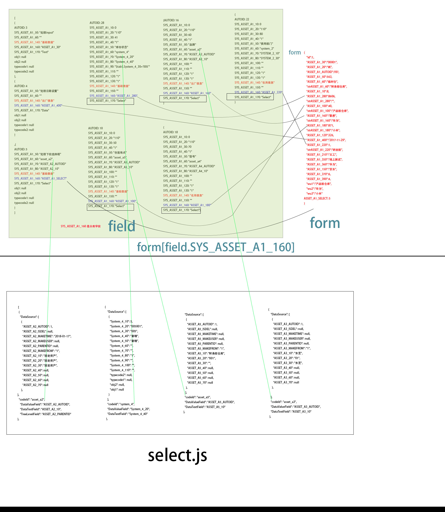

<h1 align="center">vue3-admin</h1>

## 简介

vue3-admin 是一个后台管理系统的前端页面展示，是由 vue-cli4 和 elemnet-ui 搭建实现的。使用了最新的 vue 框架，内部采用了组件化开发模式，尽可能使得每个组件都遵循单一
功能原则。虽然刚开始看起来可能略感疲惫（由于子组件功能单一，所以内部通信较多），但是对后期的维护有着非常大的好处。项目采用弹性盒（flex）布局，故而在移动端也有着较好的显示效果，可在移动端进行打开 demo 查看。

## 更快更好的开发体验，请查看下面的项目

[vue3 实战项目](https://github.com/guodonglw/vue3-admin)

## 开发

```bash
# 克隆项目
git clone git@github.com:guodonglw/vue3.0-admin.git

# 进入项目目录
cd vue3.0-admin

# 安装依赖
npm install

# 建议不要用 cnpm 安装 会有各种诡异的bug 可以通过如下操作解决 npm 下载速度慢的问题
npm install --registry=https://registry.npm.taobao.org

# 启动服务
npm run serve

# 如遇到node-sass的问题，可尝试
npm rebuild node-sass
```

浏览器访问 http://localhost:8080

# 知识点

- （1）搜索不用回车
- （2）搜索增加防抖
- （3）注册全局組件
- （4）自定义组件 v-model 的用法
- （5）select 的封装 和多级下拉
- （6）指令 placeholder 提示的封装
- （7） provide & inject 跨组件传值父传子 (父子 孙子关系)
- （8） v-bind="$attrs" v-on="$listeners" 跨组件调用事件（子调用父页面事件） (父子 孙子关系)
- （9） v-loading element 自带指令 可以直接用

# 自己学习

### 计算属性应用

```
 computed: {
    //es6给对象新增属性的方法
    handleTableAssetsData() {
      let _tableAssetsAry = []
      this.tableAssetsData.forEach(item => {
        Object.assign(item, {
          wu1: item.strASSET_A1_100,
          wu2: item.strASSET_A1_160,
          wu3: item.strASSET_A1_180,
        })
        _tableAssetsAry.push(item)
      })
      return _tableAssetsAry
    }
  }
```

### 防抖函数指令的应用 input 的防抖

#### 1 代码 src\directives\debounce.js

```
import Vue from "vue";
/**
 * @description 防抖
 * @param {function} fun 要延迟的方法
 * @param {int} delay 要延迟时间
 * @return {function} 延迟后函数
 */
const debounce = (fun = function() {}, delay = 800) => {
  let timer = null; //缓存
  return (...args) => {
    //如果上一个还没执行 先清空
    timer && clearTimeout(timer);
    //执行当前的
    timer = setTimeout(() => {
      fun.apply(this, args);
      timer = null;
    }, parseInt(delay));
  };
};
Vue.directive("debounce", {
  inserted: function(el, binding, vnode) {
    // vnode.componentOptions.listeners.input;
    // vnode.componentOptions.listeners.input.fns;
    // function(){}.prototype.fns = [];
    //如果是input
    if (vnode.componentOptions && vnode.componentOptions.tag == "el-input") {
      //得到原方法
      let Fns = vnode.componentOptions.listeners.input;
      //重写
      let newfns = [];
      Fns &&
        Fns.fns &&
        Fns.fns.forEach((item, index) => {
          //如果是第一 默认 不处理
          if (index == 0) {
            newfns.push(item);
          }
          //如果不是第一个防抖处理
          else {
            newfns.push(debounce(item));
          }
        });
      //重新赋值
      Fns.fns = newfns;
      vnode.componentOptions.listeners.input = debounce(Fns);
    }
  }
});
//防抖 全局   应用
Vue.prototype.$_debounce = debounce;

```

#### 2 注入 \src\main.js

```
import "./directives/debounce.js"; //防抖
```

#### 3 项目应用 src\directives\debounce.js

必须添加 @input="onInput" 事件否则会报错

```
 <el-form-item label="防抖函数">
    <el-input v-model="form.id" placeholder="防抖查询" @input="onInput" v-debounce style="width: 200px"></el-input>
  </el-form-item>
```

# 注册全局組件 dialog

1 写组件 src\components\element\dialog\index.vue

```
<template>
  <el-dialog ref="dialog" class="dialog alltransition" :class="[nopadding ? 'nopadding' : '']" :title="title" :visible.sync="page.dialogVisible" v-if="keep || page.dialogVisible" :close-on-click-modal="false" :close-on-press-escape="false" :width="width" v-bind="$attrs" v-on="$listeners">
    <slot ref="component"></slot>
    <div ref="footer" v-if="page.showfoot" class="el-dialog__footer dialog-footer"></div>
  </el-dialog>
</template>

<script>
export default {
  name: "ysdialog",
  data: () => ({
    page: {
      dialogVisible: false,
      showfoot: false
    }
  }),
  props: {
    title: {
      type: String,
      default: () => "编辑"
    },
    dialogVisible: {
      type: Boolean,
      default: () => false
    },
    width: {
      type: String,
      default: () => "50%"
    },
    nopadding: {
      type: Boolean,
      default: () => false
    },
    keep: {
      type: Boolean,
      default: () => false
    }
  },
  provide() {
    return {
      thisdialog: this
    };
  },
  mounted() { },
  watch: {
    dialogVisible(v) {
      if (v) {
        this.show();
      } else {
        this.close();
      }
    }
  },
  methods: {
    show() {
      this.page.dialogVisible = true;
      debugger
      this.$nextTick(() => {
        // console.log(this.$slots.default[0].componentInstance.$refs);
        const footer = this.$slots.default[0].componentInstance.$refs.footer;
        if (footer && footer.innerHTML) {
          //this.page.showfoot = true;
          // this.$nextTick(() => {
          //   this.$refs.footer.innerHTML = "";
          //   this.$refs.footer.insertAdjacentHTML("beforeend", footer.innerHTML);
          // });
        }
        // this.$slots.default[0].componentInstance.$data.thisdialog = this;
        // this.$slots.default[0].componentInstance.close = () => {
        //   this.close();
        // };
      });
      return this;
    },
    close() {
      this.page.dialogVisible = false;
      return this;
    }
  }
};
</script>

<style lang="scss" scoped>
.dialog {
  /deep/ .el-dialog__body {
    // max-height: 68vh;
    overflow: auto;
  }
}
.nopadding {
  /deep/ .el-dialog__body {
    padding: 5px;
  }
}
.dialog-footer {
  visibility: hidden;
}
</style>

```

2 导出组件 src\components\element\index.js

```
import dialogComponent from "./dialog";

//窗口
export const ysdialog = {
  install: function(Vue) {
    Vue.component("ysDialog", dialogComponent);
  }
};
```

3 全局 注册组件 src\plugins\element.js

```
import Vue from "vue";
import Element from "element-ui";
import "element-ui/lib/theme-chalk/index.css";
import "element-ui/lib/theme-chalk/base.css";
// collapse 展开折叠
import CollapseTransition from "element-ui/lib/transitions/collapse-transition";

Vue.use(Element);
//自定义
// import {
//   selectTree, //下拉树
//   window, //窗
//   pagination, //分页
//   tree, //树
//   asidetoggle, //展开收起
//   elLayout,
//   elLayoutLeft,
//   elLayoutMain,
//   select,
//   ysdialog
// } from "../components/element/index";

// Vue.use(Element);
// Vue.use(select);
// Vue.use(selectTree);
// Vue.use(pagination);
// Vue.use(tree);
// Vue.use(asidetoggle);
// Vue.use(elLayout);
// Vue.use(elLayoutLeft);
// Vue.use(elLayoutMain);
// Vue.use(ysdialog);

import * as elEx from "../components/element/index";


Object.keys(elEx).forEach(item => {  //組件註冊
  elEx[item].install && Vue.use(elEx[item]);
});

/**
 * @description 打开一个window
 * @param {Object} com 组件
 * @param {String} title 标题
 * @param {Object} data 参数
 */
Vue.prototype.$window = elEx.window;
Vue.component(CollapseTransition.name, CollapseTransition);
```

4 main.ts 里面注册

```
import "./plugins/element.js";
```

5 实例中应用 利用实例中的插槽进行显示

```
 <ys-dialog ref="AssetEditDialog" width="40%" :nopadding="true" title="资产编辑">
  777
</ys-dialog>
```

# vue 中 modal 的应用

### 在自定义组件中定义 v-model="form"

```
 <asset-ys-select  v-model="form" ></asset-ys-select>
```

### 在子组件接收

```
  props: {
    SelectValue: [String, Array, Number]
  },
  model: {
    prop: "SelectValue",// 继承了v-modal的值
    event: "change" //点击后值默认赋值给 组件的v-model 不用我们再次进行绑定了
  },
  methods: {
    async getDataSourceTow(num) {
      _this.page.SelectValue = _this.SelectValue; //项目中应用
    },
  }
```

# select 的封装 和多级下拉

### （1）代码 src\views\AssetsTable\components\AssetYsSelect.vue

```
  <ys-select
   ref="select"
   :selectList="page.DataSource"
   :idKey="page.DataValueField"
   :nameKey="page.DataTextField"
   :pIdKey="page.TreeLevelField"
    :cascader="page.DataCascader"
    :disabledKey="page.DisabledField"
     :loading="page.loading"
     filterable emitPath
     v-model="page.SelectValue"
     v-bind="$attrs"
     @change="onChange"
     >
  </ys-select>
```

### (2)字段意思

```
  SelectValue: "", //值
  DataSource: [], //数据源
  DataValueField: "", //值字段
  DataTextField: "", //显示字段
  TreeLevelField: "", //树上级ID字段  用了判断是 下拉菜单还是 多级选择
  DisabledField: "", //是否禁止 下拉选择
  DataCascader: false, //是否是tree
  loading: false //加载过程
```

### (3) 组件代码 src\components\element\select\index.vue

```
<template>
  <div>
    <!-- 下拉选择框 -->
    <el-select v-if="!pIdKey" :disabled="loading" v-nulltext v-model="page.inputVal" :style="`width:${width}`" v-bind="$attrs" v-on="$listeners" @change="onChange">
      <template v-for="item in selectList">
        <el-option :key="item[idKey]" :value="item[idKey]" :label="item[nameKey]" :disabled="item[disabledKey]"></el-option>
      </template>
    </el-select>
    <!-- 下拉选择树 -->
    <el-cascader v-else-if="cascader" :disabled="loading" v-nulltext :props="{ ...$attrs }" :options="options" v-model="page.inputVal" :style="`width:${width}`" v-bind="$attrs" v-on="$listeners" @change="onChange"></el-cascader>
  </div>
</template>
<script>
export default {
  name: "ysSelect",
  data() {
    return {

      page: {
        inputVal: this.inputVal
      }
    };
  },
  props: {
    // 下拉列表数据
    selectList: {
      type: Array,
      default: () => []
    },
    //加载过程
    loading: {
      type: Boolean,
      default: () => false
    },
    //显示在input中的数据
    inputVal: [String, Array, Number],
    //input宽度
    width: {
      type: String,
      default: "100%"
    },
    //是否禁用字段
    disabledKey: {
      type: String,
      default: ""
    },
    // 值字段名
    idKey: {
      type: String,
      default: "value"
    },
    //  lable 显示的，显示在下拉页面上的内容
    nameKey: {
      type: String,
      default: "text"
    },
    //-------------------select-tree------------------------
    //树上级ID字段
    pIdKey: "",
    //是否是tree
    cascader: {
      type: Boolean,
      default() {
        return false;
      }
    }
  },
  model: {
    prop: "inputVal",
    event: "change"
  },
  methods: {
    //选择事件
    onChange(val) {

    },
  },
  computed: {
    //计算属性
    options() {
      let _options = [];
      if (this.selectList.length == 0) {
        return [];
      }
      //this 可以获取到 所有属性
      let { selectList, idKey, pIdKey, nameKey, disabledKey } = this;
      console.log(selectList, idKey, pIdKey, nameKey, disabledKey)
      _options = JSON.parse(JSON.stringify(selectList));
      //从新设置属性
      _options.forEach(item => {
        Object.assign(item, {
          value: item[idKey], //树的 两个值
          label: item[nameKey], // 两个值
          disabled: !!item[disabledKey]
        });
      });
      //进行分类
      console.log(idKey, pIdKey)
      _options = _options.getChildren(idKey, pIdKey);
      return _options
    }
  }
}
</script>
```

### (4) 注册 src\components\element\index.js

```
import selectComponent from "./select";

//下拉
export const select = {
  install: function(Vue) {
    Vue.component("meiSelect", selectComponent);
  }
};
```

### (5) 遍历加载到全局 src\plugins\element.js

```
找到路径看代码
```

# 指令 placeholder 提示的封装

### （1）查询父标签是否有 label 如果有就把 文字拿过来插入到页面 src\directives\placeholder.js

```
import Vue from "vue";
import { hasClass } from "../utils/validate.js";
/**
 * @description 为空时提示
 */
Vue.directive("nulltext", {
  inserted: (el, binding, vnode) => {
    const text = el.__vue__.$parent.label || "内容";
    let placeholder = "请输入";
    if (hasClass(el, "el-select")) {
      placeholder = "请选择";
    }
    el.getElementsByClassName("el-input__inner")[0].placeholder =
      binding.value || placeholder + text;
  }
});

```

### （2） 注册到页面 src\main.ts

```
import "./directives/placeholder.js"; //为空提示
```

### (3) 项目应用

```
 <el-form-item label="防抖函数">
    <el-input v-model="form.id"   v-nulltext @input="onInput" v-debounce style="width: 200px"></el-input>
  </el-form-item>
```

# provide & inject 用于父组件向子孙组件传递数据(跨级访问父组件)

### （1）父亲组件中 provide 传出去 thisdialog

```
<script>
export default {
  name: "ysdialog",
  data: () => ({

  }),
  props: {

  },
  //父组件 通过provide 降自己的的数据以对象的形式传递出去
  provide() {
    return {
      thisdialog: this
    };
  },
  mounted() { },
  watch: {
    dialogVisible(v) {
      if (v) {
        this.show();
      } else {
        this.close();
      }
    }
  },
  methods: {}
};
</script>
```

### （2）孙子组件接收 inject: [ "thisdialog"],

```
<script>
import AssetYsSelect from "./AssetYsSelect.vue";
import FormList from "./json/form";  //form数据
export default {
  components: {
    AssetYsSelect
  },
  data() {
    return {
    };
  },
  inject: [ "thisdialog"],
  props: {},
  methods: {
    //点击关闭
     onClose() {
      this.thisdialog.close();
    }
  },
  mounted() { },
  computed: {},
  watch: {}
};
</script>
```

# v-bind="$attrs" v-on="$listeners" 跨组件调用事件

### 绑定页面

```
<el-select  v-bind="$attrs" v-on="$listeners" @change="onChange">
  <template v-for="item in selectList">
    <el-option :key="item[idKey]" :value="item[idKey]" :label="item[nameKey]" ></el-option>
  </template>
</el-select>

```

### 设置属性

```
export default {
  name: 'index',
  props: ['yes'],
  //  inheritAttrs：默认值true,继承所有的父组件属性（除props的特定绑定）作为普通的HTML特性应用在
  //  子组件的根元素上，如果你不希望组件的根元素继承特性设置inheritAttrs: false,但是class属性会继承
  inheritAttrs: false,
  methods: {
    onChange(data) {
      this.$emit('getListData', data)
    }
  }
```

### 父页面接收 爷爷页面接收

```
<ys-dialog ref="AssetEditDialog" width="40%" :nopadding="true" title="资产编辑">
  <AssetEdit ref="assetA1Edit" @getListData="getListData" :formdata="page.selectData"></AssetEdit>
</ys-dialog>
```

# 列表到详情的的关系表



> form 是 列表的 item
> 是要现实的 模态框列表
> 是 select 要显示的下拉列表

```
form 和 field   field 和select.js
AssetEdit ==>  AssetYsSelect ==>  components/select/index.vue
```

#表单验证

#### ref="form"

#### rules: {},

#### prop="ASSET_A1_60"

```
  <el-form class="defhetght alltransition" v-loading="page.loading" ref="form" :rules="rules" :model="form" label-width="110px" label-position="left" :disabled="readonly">
        <el-collapse v-model="page.activeNames">
          <el-collapse-item v-for="group in page.sysasseta1.group" :key="group" :name="group">
            <template slot="title">
              <span style="font-size:19px;font-weight:bold">{{ group }}</span>
            </template>
            <transition-group enter-active-class="animated fadeInDown">
              <template v-for="field in page.sysasseta1.fields">
                <el-form-item v-if="field.SYS_ASSET_A1_140 == group" :key="field.AUTOID" :prop="field.SYS_ASSET_A1_160" :label="readonly  ? field.SYS_ASSET_A1_50 + ':' : field.SYS_ASSET_A1_50 ">

                </el-form-item>
              </template>
            </transition-group>
          </el-collapse-item>
        </el-collapse>
      </el-form>
```

动态渲染 验证 方法

```
  getRules(sysasseta1) {
      let _rules = {}
      // { required: true, message: '请输入活动名称', trigger: 'blur' },
      let trigger = "blur"; //触发方式 离开
      let required = true; //必填

      requiredfields.forEach(item => {  //全局注册主键  src\utils\extend.js
        const a1 = sysasseta1.search({
          SYS_ASSET_A1_160: item
        })
        if (a1 && a1.length != 0) {
          // 对象嵌套数组
          Object.assign(_rules, {   // prop 上的属性名  == [item]
            //数组
            [item]: [
              {
                required,
                trigger,
                message: `请输入${a1[0].SYS_ASSET_A1_50}`  //SYS_ASSET_A1_50 是标题
              }
            ]
          });
        }

      });
      console.log(_rules)
      return _rules
    },
```

### 点击确认 进行验证

```
 async onSave(type) {
      this.$refs.form.validate(async valid => {
        if (valid) {

        } else {
          this.$message.error("请重新填写"); //提示
        }
      });
    },
```

# 数组赋值的写法

```
//这样不可以
//this.form[A1_160] = "xxx";

//直接赋值
this.form = Object.assign({},{
    [A1_160]:"xxx"
});
```

# 卡片用法

### 页面组件 src\views\AssetsTable\components\AssetsContent.vue

```
<ys-dialog ref="cardDialog" width="40%" :nopadding="true" title="查看详情">
      <AssetCard ref="assetCard" :cardData="page.selectData"></AssetCard>
    </ys-dialog>
```

### 点击事件打开弹框 和传递参数 src\views\AssetsTable\components\AssetsContent.vue

```
public  handleDetails(column,item) {
      this.page.selectData = item;
      this.$refs.cardDialog.show();
    }
```

### 设置选项卡切换 src\views\AssetsTable\components\AssetCard.vue

- 隐藏底部 footer
- readonly 区分 编辑 和查看详情
- 还有新增 没有解决

```
<template>
  <div id="card" class="assetCard flex" style="height:68vh">
    <el-row>
      <el-tabs v-model="page.activeName" @tab-click="handleClick">
        <el-tab-pane v-for="item in data.tabs" :key="item.name" :ref="item.name" :label="item.label" :name="item.name">
        </el-tab-pane>
      </el-tabs>
    </el-row>
    <el-row class="main">
      <transition name="breadcrumb">
        <!-- :is="page.activeName" 当前显示的内容  -->
        <!--:formdata="cardData" :readonly="true" 传递参数   -->
        <!-- 动态组件&vue-router -->
        <component :is="page.activeName" ref="cardCom" :formdata="cardData" :readonly="true" keep-alive></component>
      </transition>
    </el-row>
  </div>
</template>
<script>
export default {
  data() {
    return {
      //页面控制
      page: {
        activeName: "Details"
      },
      //数据
      data: {
        tabs: []
      }
    };
  },
  props: {
    cardData: Object  //table 数据
  },
  components: {
    Details: resolve => { require(["./AssetEdit"], resolve); }, //加载的是编辑页面
    Modify: resolve => {

    }
  },
  methods: {
    //初始化项目
    initPage() {
      this.data.tabs.push({ label: "查看详情", name: "Details" });
      this.data.tabs.push({ label: "变更详情", name: "Modify" });
    },
    handleClick() { }
  },
  mounted() {
    this.initPage();
  },
}
</script>
<style lang="less" scoped>
.assetCard {
  padding-left: 20px;
  padding-right: 20px;
}
</style>
```

# table 排序 空的排最后

### sortable="custom"

### @sort-change="OnSortChane"

```
    <el-table :data="tableAssetsData" stripe row-key="AUTOID" style="width: 100%" @sort-change="OnSortChane">
      <el-table-column prop="id" label="序号" sortable="custom" width="80">
      </el-table-column>
    </el-table>
```

### 本地排序事件

```public OnSortChane({ column, prop, order }, deprop = "id") {
    //本地内存排序
    // 1. 每次先执行默认排序 id
    // 2. 通过 prop 排序 [].sort
    if (order) {
      this.tableAssetsData.sort((m, n) => {
        //数字排序
        if (isFinite(m[prop]) && isFinite(m[prop])) {
          return n[prop] - m[prop];
        } else if (n[prop]) {
          //中文排序
          return n[prop].localeCompare(m[prop]);
        } else {
          return -1; //默认是空值
        }
      }); // 数字比较默认是倒叙
      if (order == "ascending") {
        this.tableAssetsData.reverse();
      }
    }
```

### 服务端排序

```
//设置属性
data() {
  return {
    page: {
      sort: {
        strorder: "", //字段
        ordertype: "" //方向 不为空 就是 desc
      }
    }
  };
},

//方法
OnSortChane({ column, prop, order }, deprop = "id") {
if (!order) prop = "";
  if (order == "ascending") order = "";
  this.page.sort = {
    strorder: prop,
    ordertype: order
  };
  this.getAssetA1Data(); //从新调用方法
},
```

# v-loading 指令可以直接用

```
<template>
  <div v-loading="true">
    变更详情
  </div>
</template>
```

#### 关闭

```

```

# 查看变更 动画不能超过 3.9 的版本

```

```

# 折叠按钮

### 组件 src\components\element\asidetoggle

```
<template>
  <el-button class="lefttoggle" size="small" circle icon="el-icon-arrow-left" @click="onlefttoggle"></el-button>
</template>

<script>
export default {
  data() {
    return {};
  },
  //外部属性
  props: {
    width: String
  },
  model: {
    prop: "width",
    event: "change"
  },
  //内部方法
  methods: {
    initPage() { },
    onlefttoggle() {
      //获取父元素的上面的内容
      const aiside = this.$parent.$parent;
      if (!aiside.collapsed) {
        if (!aiside.initWidth) aiside.initWidth = this.width;
        this.$emit("change", "70px");
        aiside.$el.classList.add("collapsed");
      } else {
        this.$emit("change", aiside.initWidth);
        aiside.$el.classList.remove("collapsed");
      }
      aiside.collapsed = !aiside.collapsed;
      this.$emit("onToggle", aiside.collapsed);
    }
  },
};
</script>

<style lang="less" scoped>
</style>
```

### 折叠按钮注册全局

```
import asidetoggleComponent from "./asidetoggle";

//右侧收起
export const asidetoggle = {
  install: function(Vue) {
    Vue.component("ysAsideToggle", asidetoggleComponent);
  }
};
```

### 挂载到项目上

挂载路径 src\plugins\element.js

```

```

# 项目外壳

### 模板 components\AssetSearch\index.vue

```
<template>
  <ys-layout style="height:60vh">
    <ys-layout-left title="资产字段" width="240px">
     内容
    </ys-layout-left>
    <ys-layout-main title="资产信息">
     内容
    </ys-layout-main>
  </ys-layout>
</template>
```

### 组件

```

```

# element 跨页多选 row-key

```
 row-key="System_10_10"
```

# Promise 特性

### Promise.all() //一个失败就都返回了

### Promise.race()，//只要有一个成功就都返回了

### Promise.allSettled() //无论是成功还是失败都会执行 所有内容都执行完成后，再往下执行

```
this.$refs.form.elform.validate(async valid => {
    await Promise.allSettled(
      //这里代码全部执行完成 才会弹出底部提示
    );
    this.$message("保存成功"); //提示
});
```

# 本地搜索

```
<template>
  <el-table ref="table" border :data="tableData" row-key="sysCode" height="100%" >
      <template slot="header" slot-scope="scope">
        <el-input v-model="page.search" size="small" placeholder="输入关键字搜索" clearable />
      </template>
    </el-table-column>
  </el-table>
</template>
```

#### 利用 search 方法进行搜索

```
 //计算属性
  computed: {
    //分页后的数据
    tableData() {
      let _data = [];
      _data = this.data.sysAssetA1Data;
      if (this.page.search) {
        _data = _data.search({
          SYS_ASSET_A1_50: val => val.includes(this.page.search)
        });
      }
      return _data;
    }
  },
```

# vue 操作 dom

## 通过 this

### 自己设置样式

```
  _this.$el.style.zIndex = 12
```

### 给父元素设置样式

```
this.$parent.$el.style.zIndex = 12
```

### 获取爷爷

```
this.$parent.$parent.$el
```

### 添加 class

```
  this.$el.classList.add("collapsed");
```

### 删除 class

```
this.$el.classList.remove("collapsed");
```

### \$ref

```
 this.$refs.select.$children[0].disabled
```

## 通过 操作按钮

```
<span v-show="depart" v-on:click="searchDepart($event)">部门</span>
```

```
   e.target; //是你当前点击的元素
    e.currentTarget; //是你绑定事件的元素

    //获得点击元素的前一个元素
    e.currentTarget.previousElementSibling
    //类似前前一个元素
    e.currentTarget.previousElementSibling.previousElementSibling

    //获得点击元素的第一个子元素
    e.currentTarget.firstElementChild

    //获得点击元素的下一个元素
    e.currentTarget.nextElementSibling;
    //类似下下个元素
    e.currentTarget.nextElementSibling.nextElementSibling
    　　
    //获得点击元素中id为string的元素
    e.currentTarget.getElementById("string")
  　　
    //获得点击元素的string属性
    e.currentTarget.getAttributeNode('string')
     　　
    //获得点击元素的父级元素

```

# 动态插入 form 表单

```
  <ys-form class v-loading="page.loading" ref="form" :colnub="2" :model="form" size="medium" :rules="rules">
    <!-- prop的作用是父组件向子组件单向传递数据 -->
    <el-form-item v-for="(col, index) in page.cols" :key="index" :label="col.sysName" :prop="col.SYS_ASSET_A1_160">
      <el-input v-if="!col.sysSelect && col.sysType != 'Date'" v-nulltext v-model="form[col.SYS_ASSET_A1_160]" clearable v-debounce @input="onInput"></el-input>
      <!-- 日期 -->
      <el-date-picker v-if="!col.sysSelect &&  col.sysType == 'Date' " v-model="form[col.SYS_ASSET_A1_160]" align="right" type="date" v-nulltext class="vWimp">
      </el-date-picker>
      <!-- 下拉选择框 -->
      <AssetYsSelect v-else-if="col.sysSelect" @onChange="(...ags) => {onInput(...ags, col.SYS_ASSET_A1_160);}" v-model="form[col.SYS_ASSET_A1_160]" :multiple="true" clearable :sysAssetAItem="col"></AssetYsSelect>
    </el-form-item>
  </ys-form>
```

### 组件

```
<!--<template>
  <el-form label-width="100px" label-position="left">
    <el-row v-for="(row, index) in formrow" :key="index" :gutter="20">
      <el-col v-for="(col, i) in row" :key="col.AUTOID" :span="12">
        <slot></slot>
       插槽
      </el-col>
    </el-row>
  </el-form>
</template>-->
<script>
export default {
  name: "meiform",
  data() {
    return {

      elform: {}
    };
  },
  //外部属性
  props: {
    //列数 接收参数
    colnub: {
      type: Number,
      default() {
        return 2;
      }
    },
  },
  //生成dom表单
  render(h) {
    //计算的行 和 列 [[form-item],[form-item]] newrow[0][0]
    let newrow = [] //  newrow == 上面的this.formrow
    let span = 12; //一列分为多少份 element 是24格
    if (this.$slots.default) {
      const len = this.$slots.default.length, //插槽的长度
        //一行的长度
        count = this.colnub, lineNum = len % count === 0 ? len / count : Math.floor(len / count + 1); //算出有行数 ，如果不够后面加1
      //能整除就 24直接除以变量， 如果整除不了就减一再除
      span = 24 % count === 0 ? 24 / count : Math.floor(24 / count - 1); //行数
      //循环
      for (let i = 0; i < lineNum; i++) {
        const temp = this.$slots.default.slice(i * count, i * count + count);
        newrow.push(temp);
      }
    }

    //（1）第一层form  拼接上面的dom <el-form label-width="100px" label-position="left">
    const html = h("el-form", {
      // attrs 是普通html的属性

      props: { //组件属性
        //注意驼峰写法
        labelWidth: "100px",
        labelPosition: "left",
        //属性
        ...this.$attrs //属性继承
      },
      on: { ...this.$listeners }, //事件
      ref: "elform"
    },
    //（2）第二层   <el-row v-for="(row, index) in formrow" :key="index" :gutter="20">
    //子组件 是个数组 map函数返回的就是一个数组
      newrow.map((row, index) => {
        //行
        return h("el-row", {
          props: {
            gutter: 20 //间隔20px
          },
          key: index //防止重复的dom 不渲染
        },
        // （3）第三层  <el-col v-for="(col, i) in row" :key="col.AUTOID" :span="12">
          row.map((col, i) =>
            //列
            h("el-col", {
              props: { span: span },
              key: i
            },
            // 第四层 插槽
              [col] //插槽
            )
          )
        );
      })
    );
    //返回elform
    this.$nextTick(() => {
      this.elform = this.$refs.elform;
    });

    return html
  },
  //初始化 异步加async await
  methods: {
    initPage() { }
  },
  //初始化 异步加async await
  mounted() {
    this.initPage();
  },
}
</script>
```

### 注册组件

```
//动态表单布局
export const meiform = {
  install: function(Vue) {
    Vue.component("ysForm", formComponent);
  }
};
```

### 第四步和第五步省略

```

```

# 数据驱动 dom 的必要条件

```
item:{
  value:'',//要保留的值
  type:'',分类, input  select data
  name:'',要显示在页面的名字,
  label:"",标题名,
  list:[ //select 选中的字段
    {}
  ],
  item:{}, //原来的值
}
```

# 拆分 el-table 的表格 给表头 和表格内增加内容

```

```

# 编辑功能 必须等待页面返回数据后再进行赋值,否则验证会出bug
```
```